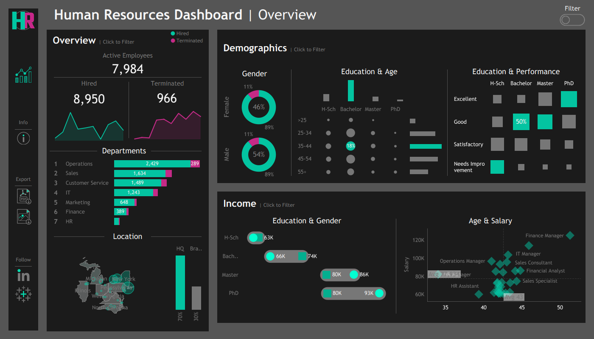

# 👥 Human Resources Analytics Dashboard | Tableau

An interactive **Tableau dashboard** for analyzing workforce composition, hiring and termination activity, employee demographics, compensation, performance, departments, and geographic distribution.

> **[🔗 View Interactive Dashboard on Tableau Public](https://public.tableau.com/app/profile/bhaskar.nakka4980/viz/HRDashboard_17824941977350/HRSummary_1)**



---

## 🎯 Project Objective

The objective of this project is to transform employee-level HR data into an interactive business intelligence dashboard that provides a centralized view of workforce characteristics and employment activity.

The dashboard helps users analyze:

- Workforce size and employment status
- Hiring and termination activity
- Department-wise employee distribution
- Employee demographics
- Education and performance
- Salary and compensation patterns
- Geographic workforce distribution

---

## 📌 Key Performance Indicators

| KPI | Value |
|---|---:|
| Active Employees | **7,984** |
| Hired Employees | **8,950** |
| Terminated Employees | **966** |

These KPIs provide a high-level overview of the workforce and employee movement within the dataset.

---

## 📊 Dashboard Analysis

### Workforce Overview

The dashboard provides an overview of:

- Active employees
- Hired employees
- Terminated employees
- Department-wise workforce distribution

This allows users to quickly understand the overall workforce structure.

### Employee Demographics

The dashboard analyzes workforce composition across:

- Gender
- Age groups
- Education levels

These views help users understand the demographic characteristics of the workforce.

### Education & Performance

Employee education levels are compared with performance ratings to explore differences in workforce performance across education groups.

### Compensation Analysis

Salary patterns are analyzed across:

- Education level
- Gender
- Age
- Job roles

The dashboard also provides an **Age & Salary** analysis to examine how compensation varies across employees.

### Geographic Distribution

A geographic view shows where employees are distributed across different locations, providing insight into workforce concentration.

---

## 🎛️ Dashboard Features

- Executive KPI summary
- Department-wise workforce analysis
- Gender distribution
- Age-group analysis
- Education-level analysis
- Performance rating analysis
- Salary analysis
- Geographic distribution
- Interactive filters
- Tableau dashboard visualizations

---

## 💡 Key Business Questions

The dashboard helps answer questions such as:

- Which departments have the largest workforce?
- How many employees are currently active?
- How many employees have been hired and terminated?
- What is the gender distribution of employees?
- How is the workforce distributed across age groups?
- How does performance vary across education levels?
- Which job roles have higher salary levels?
- How does salary vary with employee age?
- Where is the workforce geographically concentrated?

---

## 🗂️ Dataset

This project uses a **synthetic HR dataset** created for analytics and dashboard development.

### Dataset Details

| Attribute | Description |
|---|---|
| Dataset Type | Synthetic HR Dataset |
| Format | CSV |
| Records | 8,950 employee records |
| Data Source | Synthetic dataset |

The dataset contains employee attributes including:

- Employee ID
- First Name
- Last Name
- Gender
- Birth Date
- Hire Date
- Termination Date
- State
- City
- Department
- Job Title
- Education Level
- Salary
- Performance Rating
- Overtime Status

### Data Privacy

The dataset is completely synthetic and contains **no real employee or confidential organizational information**.

It is intended for educational, portfolio, visualization, and analytics purposes.

---

## 🛠️ Tools & Technologies

- **Tableau** — Dashboard development and data visualization
- **Python** — Synthetic dataset generation and preparation
- **Pandas** — Data manipulation
- **NumPy** — Numerical data generation
- **Faker** — Synthetic data generation
- **CSV** — Data storage
- **Git & GitHub** — Version control and project management

---

## 📚 Skills Demonstrated

- Tableau Dashboard Development
- HR Analytics
- Data Visualization
- KPI Design
- Workforce Analysis
- Demographic Analysis
- Compensation Analysis
- Performance Analysis
- Trend Analysis
- Interactive Dashboard Design
- Business Intelligence
- Data Storytelling
- Synthetic Data Generation
- Data Preparation

---

## 📁 Repository Structure

```text
HR Dashboard/
│
├── data/
│   └── dataset.csv
│
├── images/
│   └── HR-Dashboard.png
│
├── tableau/
│   └── HR Dashboard.twbx
│
└── README.md